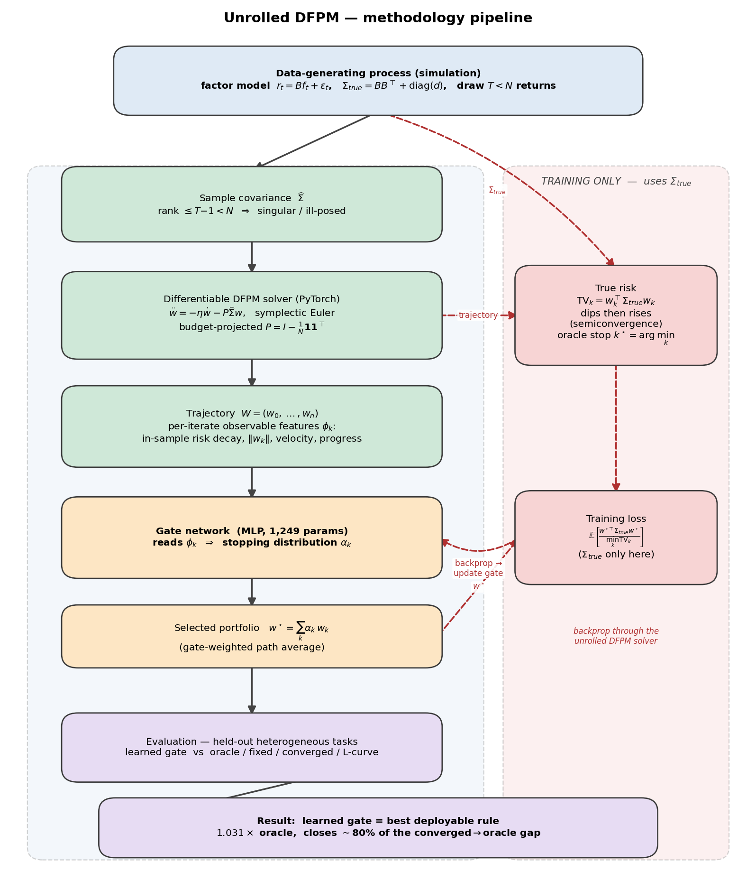
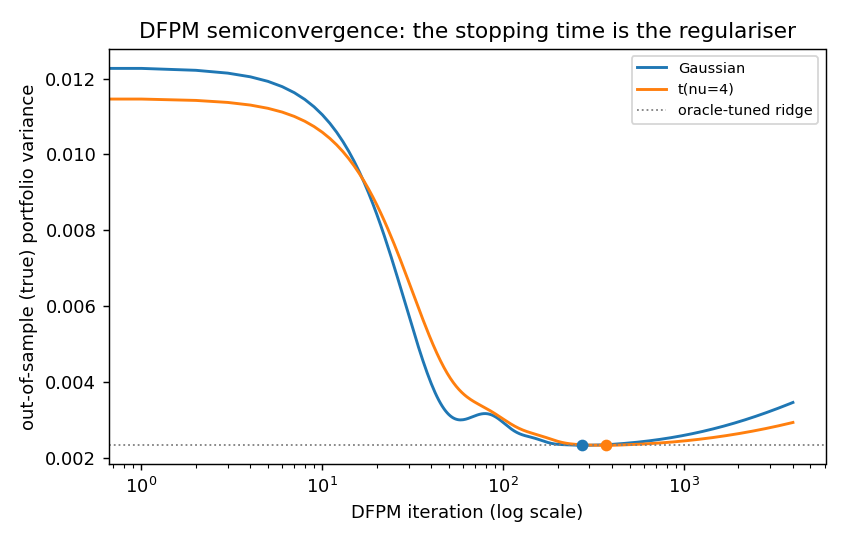
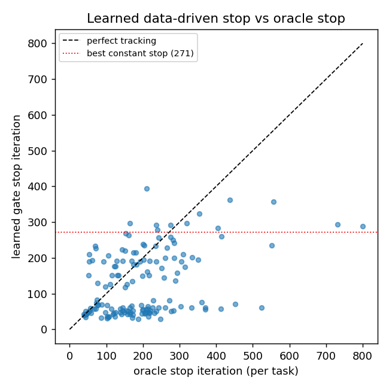
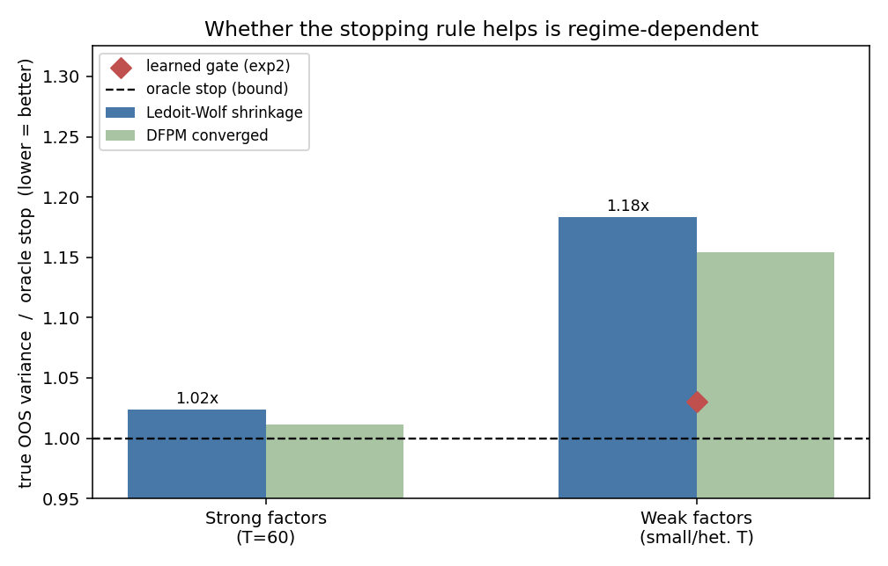
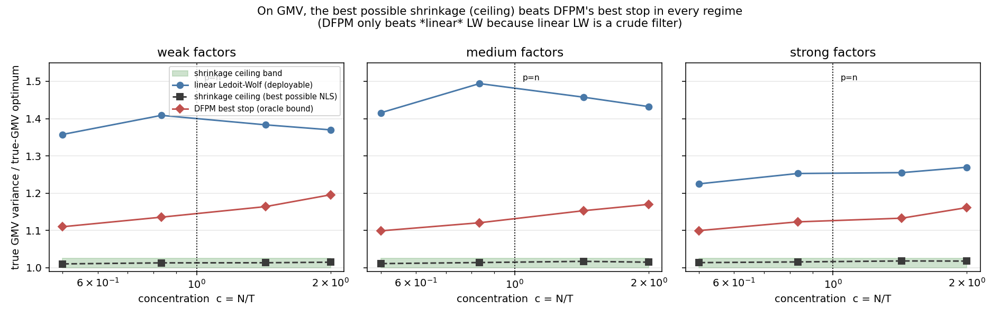

# Unrolled DFPM — Learning a Data-Driven Stopping Rule for Damped-Dynamical Portfolio Solvers

A small, reproducible study of **early stopping as implicit regularization** for
ill-posed portfolio optimization, and of whether that stopping rule can be
**learned** rather than guessed.

When the number of assets `N` is comparable to or larger than the number of
return observations `T`, the sample covariance matrix is rank-deficient and the
minimum-variance portfolio becomes ill-posed. The Damped Dynamical / Functional
Particle Method (DFPM) solves such problems by integrating a *second-order damped
dynamical system* to its steady state, never inverting the covariance. This repo
shows that **the integration step index is an implicit regularization path** — out-of-sample
risk dips then rises along the trajectory — and that a small network, unrolled
through the differentiable solver, can learn a deployable stopping rule. It also
asks the honest question most write-ups skip: **does any of this beat closed-form
shrinkage?** Against *linear* shrinkage the answer is regime-dependent; against the
*best possible* shrinkage it is **no, on minimum-variance** — and the repo shows
exactly why (the GMV trajectory is a spectral filter, so shrinkage dominates it),
which is precisely what redirects the work to a non-quadratic (CVaR) objective.

> Context: an exploratory pilot for a PhD project on ill-posed portfolio
> optimization (damped dynamical systems + singular-covariance estimation
> theory). It is intentionally honest about where the method helps and where it
> does not.

---

## The pipeline at a glance



The left lane runs at deployment and uses **only observable quantities**. The
population covariance `Σ_true` enters **only** the offline training loss (right
lane) — never the network's input — so the learned rule is deployable on real
data.

---

## Why `N > T` makes the problem ill-posed

A covariance over `N` assets has `N(N+1)/2` free parameters. With `T < N`
observations the sample covariance `Σ̂` is a sum of `T` rank-one terms, so
`rank(Σ̂) ≤ T − 1 < N`: it is **singular**, reporting *exactly zero* variance
along `N − (T−1)` directions. Those "zero-risk" directions are an artefact of
scarce data, but a minimum-variance optimizer believes them and levers in,
producing portfolios that look excellent in-sample and collapse out-of-sample.
Even for `T > N`, inversion divides by the smallest sample eigenvalues — the most
corrupted and the closest to zero (Marčenko–Pastur spreading) — amplifying
estimation error.

DFPM sidesteps the inversion. It recasts the global minimum-variance problem

```
min_w  ½ wᵀ Σ̂ w     s.t.   1ᵀw = 1
```

as the steady state of

```
ẅ = −η ẇ − P Σ̂ w ,      P = I − (1 1ᵀ)/N ,      w(0) = 1/N ,  ẇ(0) = 0
```

and integrates it. `P` projects onto the budget-constraint tangent space, so a
feasible start stays feasible; each step is a matrix–vector product, never an
`O(N³)` inverse.

---

## Result 1 — semiconvergence: the stopping time *is* the regularizer



Along the trajectory, out-of-sample (true) variance falls to a floor and then
**rises** as the system converges onto the noisy near-null directions of `Σ̂`.
The early-stopped DFPM portfolio matches an oracle-tuned ridge penalty **without
ever forming or inverting `Σ̂ + λI`**; the fully converged solution is markedly
worse. `N=100`, `K=5`, `T=60`, 200 Monte-Carlo replications:

| Method | Gaussian | Student-t(ν=4) |
|---|---|---|
| Equal weight (1/N) | 0.01229 | 0.01148 |
| Plug-in GMV (pseudo-inverse) | 0.00941 | 0.01094 |
| **DFPM, best stop** *(oracle)* | **0.00224** | **0.00224** |
| DFPM, converged | 0.00346 | 0.00293 |
| Ridge GMV, oracle λ *(oracle)* | 0.00234 | 0.00231 |
| True GMV (lower bound) *(oracle)* | 0.00193 | 0.00192 |

*Caveat:* the size of the dip is **draw-dependent** — ~1.5× (converged/best-stop)
here, but only ~1.02× on a strongly factor-dominated covariance. The prize a
stopping rule competes for is a property of the regime, not a constant.

---

## Result 2 — a learned, deployable stopping rule

The oracle stop uses `Σ_true` and is not implementable. We **learn** a stopping
rule by unrolling the differentiable solver: a 1,249-parameter gate reads four
run-time-observable features at each iterate (in-sample risk decay, weight norm,
step velocity, progress) and outputs a stopping distribution `α_k`; the deliverable
is the gate-weighted path average `w* = Σ_k α_k w_k`. `Σ_true` enters only the
training loss, never the gate input.

On 150 held-out **heterogeneous** tasks (varying `T ∈ [40,140]`, `K ∈ {2,5,10}`,
idiosyncratic level, tail index), so the oracle stop genuinely varies
(mean 199, std 125, range [38, 800]):

| Rule | Mean true OOS var | Regret vs. oracle | Deployable |
|---|---|---|---|
| Oracle stop (bound) | 0.00364 | 1.000× | no |
| **Learned gate** | **0.00375** | **1.031×** | **yes** |
| Best fixed iteration (tuned) | 0.00385 | 1.058× | yes |
| DFPM converged | 0.00420 | 1.154× | yes |
| Ledoit–Wolf shrinkage GMV | 0.00431 | 1.183× | yes |
| L-curve corner | 0.00446 | 1.225× | yes |
| Plug-in GMV (pseudo-inverse) | 0.05301 | 14.6× | yes |



The gate's hard-argmax stop tracks the per-task oracle only loosely (corr ≈ 0.40,
bimodal). The honest reading: most of the gain is **gate-weighted path-averaging**
(a Polyak-style ensemble over the regularization path), not pinpoint stopping.

---

## Result 3 — the honest crux: does it beat closed-form shrinkage?

Ledoit–Wolf shrinkage is the natural deployable competitor — closed-form, no
tuning, no DFPM. **Whether the learned rule beats it depends entirely on the
regime.**



| | Strong factors, T=60 | Weak factors, small T |
|---|---|---|
| Ledoit–Wolf GMV (deployable) | 0.00192 | 0.00431 |
| Oracle stop (bound) | 0.00188 | 0.00364 |
| **Headroom above shrinkage** | **~2.4% (negligible)** | **~18% (real)** |
| Learned gate beats Ledoit–Wolf? | no (redundant) | yes |

On strong factors, Ledoit–Wolf nearly saturates the oracle frontier and the gate
is redundant. On weak factors / very small samples, *linear* shrinkage leaves real
headroom and the gate beats it. But linear Ledoit–Wolf is a crude, one-dial
filter — so the natural follow-up is whether a stronger *nonlinear* shrinkage
would close even that gap. Result 4 settles it.

---

## Result 4 — the de-risking test: could nonlinear shrinkage close the gap?

Rather than implement (and risk mis-implementing) analytical nonlinear shrinkage,
we compute the exact **shrinkage ceiling**: the lowest true-GMV variance achievable
by *any* rotation-equivariant shrinkage estimator — linear, nonlinear, realizable,
or oracle — because every such estimator is `U diag(d) Uᵀ` with the sample
eigenvectors `U` and some `d > 0`. That is a small convex QP, and it upper-bounds
**all** shrinkage methods at once.



Sweeping factor strength × concentration `c = N/T` (crossing into the singular
`p > N` regime), the picture is the same everywhere:

| | regret over true GMV (range across the sweep) |
|---|---|
| Shrinkage ceiling (best possible NLS) | **1.01 – 1.02×** (essentially optimal) |
| DFPM best stop (oracle bound) | 1.10 – 1.20× |
| Linear Ledoit–Wolf (deployable) | 1.23 – 1.49× |

**The verdict, stated plainly:** the shrinkage ceiling sits ~1–2% above the true
optimum in *every* regime, and it is **below DFPM's best possible stop everywhere**.
DFPM beats *linear* Ledoit–Wolf only because linear LW is a crude filter that
leaves 25–50% on the table; a nonlinear shrinkage that reaches its ceiling would
overtake DFPM on GMV in all regimes tested.

There is a clean reason. For the quadratic GMV objective the DFPM trajectory is
itself a **spectral filter** of `Σ̂` (early stopping ≈ ridge ≈ a one-parameter
filter family), while shrinkage optimizes the filter freely — so shrinkage *cannot*
be beaten by DFPM on GMV, even in principle. **This kills the GMV branch as a
contribution and rigorously redirects the work to a non-quadratic objective**
(CVaR), where the spectral-filter equivalence breaks and the regularization path
can express portfolios no covariance-shrinkage can.

> This is a deliberately self-critical result. The point of the pilot was to
> *locate* where the method has a defensible edge — and to rule out where it does
> not. On minimum-variance, it does not.

---

## Honest limitations

- **Oracle baselines are bounds, not methods** — they use `Σ_true` to measure regret.
- **Path-averaging, not pinpoint stopping** — the soft portfolio beats hard stopping; the gate does not sharply recover the oracle stop.
- **On GMV, optimal shrinkage dominates DFPM** (Result 4) — the favourable Result-2/3 numbers are wins over *linear* shrinkage only; the best possible shrinkage beats DFPM's best stop in every regime tested. The defensible value of the method is therefore *not* on minimum-variance.
- **Step size is conservative** — we integrate at `Δt = 0.25/λ_max`, well inside the `Δt < 2/√λ_max` stability bound, so iteration *indices* here are larger than the canonical `1/√λ` convention. Conclusions are unaffected.
- **Simulated data, one heavy-tail family (Student-t)** — any simulator-trained rule inherits simulator bias; the honest test is out-of-distribution on real returns.

---

## Where this points

1. **CVaR under tempered-stable (NTS) returns** — smoothed Rockafellar–Uryasev CVaR solved jointly on `(w, α)` by DFPM, under genuinely skewed heavy tails. The CVaR objective is *not quadratic in `w`*, so the spectral-filter equivalence that lets shrinkage dominate on GMV (Result 4) **breaks** — the DFPM path can express portfolios no covariance-shrinkage can, and no closed-form shrinkage analogue exists. *(Primary direction, and now rigorously motivated rather than a hunch.)*
2. **An estimation-theoretic stopping rule** — relate the optimal stop to an effective-rank / signal-to-noise quantity from singular-Wishart portfolio-weight theory, for a principled rather than black-box rule.
3. **Full unrolling** — make `η` and `Δt` learnable too, not just the stopping gate.

---

## Repository structure

```
src/
  dfpm.py                      # differentiable DFPM solver (PyTorch), dynamics, risk metrics
  dgp.py                       # factor-model data-generating process, Gaussian / Student-t tails
  exp1_semiconvergence.py      # Result 1: semiconvergence + reference portfolios + figure
  exp2_learned_stopping.py     # Result 2: train the gate, evaluate, gate-vs-oracle scatter
  exp3_ledoitwolf_regimes.py   # Result 3: Ledoit-Wolf regime comparison + figure
  exp4_crossover.py            # Result 4: shrinkage-ceiling crossover sweep + figure
  make_flowchart.py            # renders the methodology flowchart
figures/                       # generated figures (committed)
results/                       # generated CSVs (committed)
requirements.txt
```

## Reproduce

```bash
pip install -r requirements.txt
python src/exp1_semiconvergence.py      # semiconvergence figure + trajectory CSV
python src/exp2_learned_stopping.py     # train gate, evaluate, scatter (uses PyTorch)
python src/exp3_ledoitwolf_regimes.py   # regime-dependence comparison + figure
python src/exp4_crossover.py            # shrinkage-ceiling crossover sweep + figure
python src/make_flowchart.py            # regenerate the pipeline flowchart
```

Seeds are fixed for reproducibility. A CUDA GPU is used automatically if present
but is not required.

## References

**Independently verified:**
- M. Gulliksson, S. Mazur, A. Oleynik (2025). *Minimum VaR and minimum CVaR optimal portfolios: the case of singular covariance matrix.* Results in Applied Mathematics **26**, 100557. ([link](https://www.sciencedirect.com/science/article/pii/S2590037425000214))

**Methodological context (confirm exact details before formal citation):**
DFPM / damped dynamical systems (Gulliksson, Ögren and collaborators);
singular-Wishart portfolio-weight theory (Bodnar, Mazur and collaborators);
covariance shrinkage (Ledoit & Wolf, 2004); CVaR optimization (Rockafellar &
Uryasev, 2000); conformal-symplectic integration (Hairer–Lubich–Wanner);
learning-to-optimize / unrolled optimization.

## Author

**Akash Deep** — exploratory work in high-dimensional portfolio statistics,
heavy-tailed risk, and damped-dynamical-system solvers.

Released under the MIT License.
